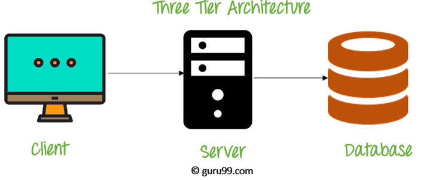
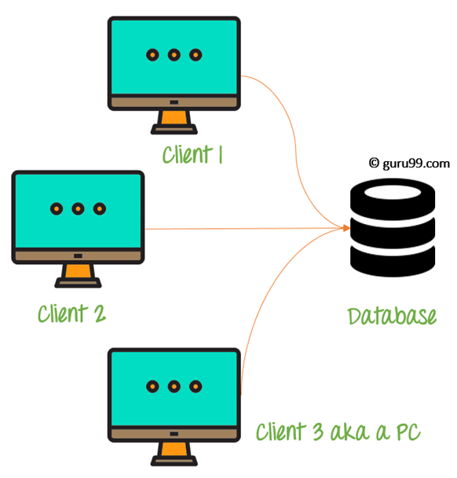

# Important Questions 

1. What is DBMS ? Mention advantages..

    > Database Management System (DBMS) is a software for storing and retrieving users’ data while considering appropriate security measures. It consists of a group of programs which manipulate the database. The DBMS accepts the request for data from an application and instructs the operating system to provide the specific data. In large systems, a DBMS helps users and other third-party software to store and retrieve data.

    Advantages : 
    1. Improved data sharing
    2. Improved data security
    3. Better data integration
    4. Minimised data inconsistency
    5. Improved data access
    6. Improved decision making

2. What is Database?

    > A database is an organised collection of structured information, or data, typically stored electronically in a computer system. A database is usually controlled by a database management system (DBMS). Together, the data and the DBMS, along with the applications that are associated with them, are referred to as a database system, often shortened to just a database.

3. What is a database system?

    > A database management system (or DBMS) is essentially nothing more than a computerized data-keeping system. Users of the system are given facilities to perform several kinds of operations on such a system for either manipulation of the data in the database or the management of the database structure itself.

4. What is RDBMS ? Properties..

    > A Relational Database Management system (RDBMS) is a database management system that is based on the relational model. It has the following major components: Table, Record/Tuple/Row, Field, and Column/Attribute. Examples of the most popular RDBMS are MYSQL, Oracle, IBM DB2, and Microsoft SQL Server database.

    Relational databases have the following properties:
    1. Values are atomic.
    1. All of the values in a column have the same data type.
    1. Each row is unique.
    1. The sequence of columns is insignificant.
    1. The sequence of rows is insignificant.
    1. Each column has a unique name.
    1. Integrity constraints maintain data consistency across multiple tables.

5. Types of database languages : DDL, DML, DCL, TCL

    1. **Data Definition Language:** DDL stands for Data Definition Language. It is used to define database structure or pattern.
    1. **Data Manipulation Language:** DML stands for Data Manipulation Language. It is used for accessing and manipulating data in a database. It handles user requests.
    1. **Data Control Language:** DCL stands for Data Control Language. It is used to retrieve the stored or saved data.
    1. **Transaction Control Language:** TCL is used to run the changes made by the DML statement. TCL can be grouped into a logical transaction

6. ACID properties (VVVVV IMP)

    > To ensure the consistency of the database, certain properties are followed by all the transactions occurring in the system.

    These properties are called ACID Properties of a transaction.
    1. Atomicity
    1. Consistency
    1. Isolation
    1. Durability

7. Difference between vertical and horizontal scaling.  [YT](https://www.youtube.com/watch?v=3GGPsX-s5-M)

    > Scaling alters the size of a system. In the scaling process, we either compress or expand the system to meet the expected needs. The scaling operation can be achieved by adding resources to meet the smaller expectation in the current system, or by adding a new system in the existing one, or both.

    > Vertical scaling keeps your existing infrastructure but adds computing power. Your existing pool of code does not need to change — you simply need to run the same code on machines with better specs. By scaling up, you increase the capacity of a single machine and increase its throughput. Vertical scaling allows data to live on a single node, and scaling spreads the load through CPU and RAM resources for your machines.

    > Horizontal scaling simply adds more instances of machines without first implementing improvements to existing specifications. By scaling out, you share the processing power and load balancing across multiple machines.

8. What is sharding [YT](https://www.youtube.com/watch?v=XP98YCr-iXQ)

    > Sharding is a method of splitting and storing a single logical dataset in multiple databases. By distributing the data among multiple machines, a cluster of database systems can store larger dataset and handle additional requests. Sharding is necessary if a dataset is too large to be stored in a single database. Moreover, many sharding strategies allow additional machines to be added. Sharding allows a database cluster to scale along with its data and traffic growth.

9. Keys in DBMS

    > A key is a set of attributes that can identify each tuple uniquely in the given relation.

    Types of Keys:

    1. Super Key – A superkey is a set of attributes that can identify each tuple uniquely in the given relation. A super key may consist of any number of attributes.
    1. Candidate Key – A set of minimal attribute(s) that can identify each tuple uniquely in the given relation is called a candidate key.
    1. Primary Key – A primary key is a candidate key that the database designer selects while designing the database. Primary Keys are unique and NOT NULL.
    1. Alternate Key – Candidate keys that are left unimplemented or unused after implementing the primary key are called alternate keys.
    1. Foreign Key – An attribute ‘X’ is called as a foreign key to some other attribute ‘Y’ when its values are dependent on the values of attribute ‘Y’. The relation in which attribute ‘Y’ is present is called the referenced relation. The relation in which attribute ‘X’ is present is called the referencing relation.
    1. Composite Key – A primary key composed of multiple attributes and not just a single attribute is called a composite key.
    1. Unique Key – It is unique for all the records of the table. Once assigned, its value cannot be changed i.e. it is non-updatable. It may have a NULL value.

10. Types of relationship

    > A relationship is defined as an association among several entities.

    1. Unary Relationship Set – Unary relationship set is a relationship set where only one entity set participates in a relationship set.
    1. Binary Relationship Set – Binary relationship set is a relationship set where two entity sets participate in a relationship set.
    1. Ternary Relationship Set – Ternary relationship set is a relationship set where three entity sets participate in a relationship set.
    1. N-ary Relationship Set – N-ary relationship set is a relationship set where ‘n’ entity sets participate in a relationship set.

11. Data abstraction in DBMS, three levels of it. [YT](https://www.youtube.com/watch?v=2ie8fvgIsOU)

    > Data Abstraction is a process of hiding unwanted or irrelevant details from the end user. It provides a different view and helps in achieving data independence which is used to enhance the security of data.

    .png)

    Three level of data abstractions : 
    1. Physical or Internal Level. 
    2. Logical or Conceptual Level. 
    3. View or External Level.

12. Indexing in DBMS [YT](https://www.youtube.com/watch?v=xXtig5uLQS4)

    > Indexing is a way to optimise the performance of a database by minimising the number of disk accesses required when a query is processed. It is a data structure technique which is used to quickly locate and access the data in a database.

13. What is DDL (Data Definition Language)

    > DDL stands for Data Definition Language. It is used to define database structure or pattern.
    It is used to create schema, tables, indexes, constraints, etc. in the database.
    Using the DDL statements, you can create the skeleton of the database.
    Data definition language is used to store the information of metadata like the number of tables and schemas, their names, indexes, columns in each table, constraints, etc.

14. What is DML (Data Manipulation Language)

    > DML stands for Data Manipulation Language. It is used for accessing and manipulating data in a database. It handles user requests.

15. What is normalization ? Types of them.. [YT](https://www.youtube.com/watch?v=ABwD8IYByfk)

    > Normalization is the process of organizing data by disintegrating bigger table into smaller one’s with proper dependencies. Redundant Data wastes a lot of disk space and creates maintenance problems (Update, Insert and Delete Anomaly). Hence the DB tables should be Normalized.

    > The process of Normalization is achieved by following some rules which are defined as Normal Forms. There are basically 3 types of Normal Form – 1NF, 2NF, 3NF. Strictness increases as we go from 1NF to 3NF.

    > Apart from the above mentioned Normal Form there exist one more Form called Boyce Codd Normal Form (BCNF) . This is an advanced version of 3NF and is even stricter than 3NF.

16. What is denormalization? [YT](https://www.youtube.com/watch?v=HB2pTF2myXI)

    > Denormalization is a database optimization technique in which we add redundant data to one or more tables. This can help us avoid costly joins in a relational database. Note that denormalization does not mean not doing normalisation. It is an optimization technique that is applied after doing normalisation.

17. What is functional dependency ? [YT](https://www.youtube.com/watch?v=wez3fXrjBAE)

    > A functional dependency is a constraint that specifies the relationship between two sets of attributes where one set can accurately determine the value of other sets. It is denoted as X → Y, where X is a set of attributes that is capable of determining the value of Y. The attribute set on the left side of the arrow, X is called Determinant, while on the right side, Y is called the Dependent.

18. E-R Model ? [YT](https://www.youtube.com/watch?v=5nGC4fyFPes&t=566s)

    > ER model stands for an Entity-Relationship model. It is a high-level data model. This model is used to define the data elements and relationship for a specified system.

    > It develops a conceptual design for the database. It also develops a very simple and easy to design view of data.
    In ER modelling, the database structure is portrayed as a diagram called an entity-relationship diagram.

19. Conflict Serializability in DBMS [YT](https://www.youtube.com/watch?v=24k2CZ8CKU8)
    > Serializability is a concept that helps us to check which schedules are serializable. A serializable schedule is the one that always leaves the database in consistent state.

    > A schedule is called conflict serializability if after swapping of non-conflicting operations, it can transform into a serial schedule. The schedule will be a conflict serializable if it is conflict equivalent to a serial schedule.

21. What is CCP ? (Concurrency Control Protocols) [YT](https://www.youtube.com/watch?v=fTRF3cr10RQ)

    > Concurrency Control is the management procedure that is required for controlling concurrent execution of the operations that take place on a database.

    > The concurrency control protocols ensure the atomicity, consistency, isolation, durability and serializability of the concurrent execution of the database transactions.

    Therefore, these protocols are categorised as:

    1. Lock Based Concurrency Control Protocol
    1. Timestamp Concurrency Control Protocol
    1. Validation Based Concurrency Control Protocol

22. Entity, Entity Type, Entity Set, Weak Entity Set..

23. What are SQL commands ? Types of them.. [YT](https://www.youtube.com/watch?v=hlGoQC332VM)
24. Nested Queries in SQL ? [YT](https://www.youtube.com/watch?v=lBpSMeQjNqQ)
25. What is JOIN.. Explain types of JOINS [YT](https://www.youtube.com/watch?v=zGSv0VaOtR0)

    > Here are the different types of the JOINs in SQL:

    1. (INNER) JOIN: Returns records that have matching values in both tables
    1. LEFT (OUTER) JOIN: Returns all records from the left table, and the matched records from the right table
    1. RIGHT (OUTER) JOIN: Returns all records from the right table, and the matched records from the left table
    1. FULL (OUTER) JOIN: Returns all records when there is a match in either left or right table

26. Inner and Outer Join

27. Practice sql queries from leetcode

28. Diff between 2 tier and 3 tier architecture [YT](https://www.youtube.com/watch?v=GX9hTGSc_1s)

    | Two-Tier Database Architecture | Three-Tier Database Architecture |
    |-------------------------------|----------------------------------|
    | It is a Client-Server Architecture. | It is a Web-based application. |
    | In two-tier, the application logic is either buried inside the user interface on the client or within the database on the server (or both). | In three-tier, the application logic or process resides in the middle-tier, it is separated from the data and the user interface. |
    | Two-tier architecture consists of two layers: Client Tier and Database (Data Tier). | Three-tier architecture consists of three layers: Client Layer, Business Layer, and Data Layer. |
    | It is easy to build and maintain. | It is complex to build and maintain. |
    | Two-tier architecture runs slower. | Three-tier architecture runs faster. |
    | It is less secured as the client can communicate with the database directly. | It is secured as the client is not allowed to communicate with the database directly. |
    | It results in performance loss whenever the users increase rapidly. | It results in performance loss whenever the system is run on the Internet but gives more performance than two-tier architecture. |
    | Example – Contact Management System created using MS-Access or Railway Reservation System, etc. |

    
    
    

29. Diff between TRUNCATE and DELETE command
    > DELETE is a DML(Data Manipulation Language) command and is used when we specify the row (tuple) that we want to remove or delete from the table or relation. The DELETE command can contain a WHERE clause. If the WHERE clause is used with the DELETE command, then it removes or deletes only those rows (tuples) that satisfy the condition; otherwise, by default, it removes all the tuples (rows) from the table. Remember that DELETE logs the row deletions.

    > TRUNCATE is a DDL(Data Definition Language) command and is used to delete all the rows or tuples from a table. Unlike the DELETE command, the TRUNCATE command does not contain a WHERE clause. In the TRUNCATE command, the transaction log for each deleted data page is not recorded. Unlike the DELETE command, the TRUNCATE command is fast. We cannot roll back the data after using the TRUNCATE command. 

30. Difference between Intension and Extension in a DataBase
    > Extension:The Extension is the number of tuples present in a table at any instance. tuples are created, updated and destroyed. The actual data in the database change qu the data in the database at a particular moment in time is known as extension or snapshot. It is time dependent. 
    
    > Intension:Intension is also known as Data Schema and defined as the description which is specified during database design and is expected to remain unchanged. T constant value that gives the name, structure of tables and the constraints laid on it.
31. Difference between share lock and exclusive lock, definition of lock

    | Characteristic       | Shared Lock (S)                                               | Exclusive Lock (X)                                           |
    |-----------------------|--------------------------------------------------------------|--------------------------------------------------------------|
    | **Functionality**     | Permits reading by other transactions but prevents updates.  | Allows both reading and writing, blocking other accesses. |
    | **Usage** | Used for reading data items only.| Used when modification of data is needed.|
    | **Read Integrity**    | Supports read integrity, ensuring no updates during reads.   | Does not support read integrity as it allows writing.         |
    | **Prevents Updates**  | Prevents updates of the data until the shared lock is released. | Prevents any other transactions from accessing the data.      |
    | **Ownership**         | Can be held by multiple transactions simultaneously for reading. | Owned exclusively by one transaction at a time.|
    | **Denoted By** | Lock-S | Lock-X |
    | **Example Scenario**  | If two transactions are reading A, one can't update A until the other has finished reading. | A transaction holding an exclusive lock prevents other transactions from reading or writing to A. |
    | **Instruction**       | `Lock-S` instruction | `Lock-X` instruction  |
