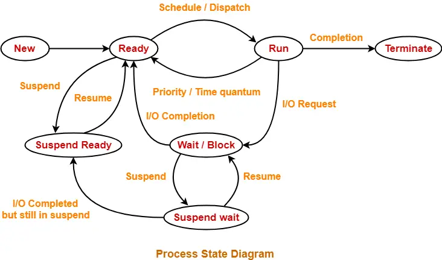

# important questions
1. ## Process diagram : 

    
1. ### What is the main purpose of an operating system? Discuss different types?
    > The operating system (OS) manages all of the software and hardware on the computer. It performs basic tasks such as file, memory and process management, handling input and output, and controlling peripheral devices such as disk drives and printers.
    
    types of operating system : 
    1. **Batch Operating System :** A batch operating system is a type of operating system that allows multiple users to use it at the same time, without direct communication between them.
    2. **Multi-Programming Operating System :** A multiprogramming operating system (OS) allows multiple programs to run simultaneously on a single CPU. This is done by allocating CPU time to different programs so that it appears they are all running at the same time.
    3. **Multi-Processing Operating System :** Multiprocessor operating systems are used in operating systems to boost the performance of *multiple CPUs* within a single computer system. Multiple CPUs are linked together so that a job can be divided and executed more quickly. When a job is completed, the results from all CPUs are compiled to provide the final output.
    4. **Multi-Tasking Operating System :** Multi tasking operating systems allow multiple users to perform multiple tasks at the same time. The allocation of system resources such as input/output devices, CPU and memory among processes can be easily managed by multi-tasking operating system.
    5. **Time-Sharing Operating Systems :** Time-sharing is a method of allowing multiple individuals at different terminals to access the same computer system simultaneously. Multiprogramming is logically followed by time-sharing.
    6. **Real Time OS :** A real-time operating system (RTOS) is a special-purpose operating system that processes data and events with critical time constraints. RTOSes are designed for critical systems and devices like microcontrollers that are timing-specific. 

2. ### What is a socket. kernel and monolithic kernel ?
    > A socket is a software object that establishes a two-way communication link between two programs running on a network. Sockets are mainly used in client-server based systems

    > Kernel is central component of an operating system that manages operations of computer and hardware. It basically manages operations of memory and CPU time. Kernel acts as a bridge between applications and data processing performed at hardware level using inter-process communication and system calls. types of kernel : Monolithic Kernel, Microkernel, Hybrid Kernel, Nano Kernel, Exo Kernel.
    
    > A monolithic kernel is an operating system architecture where the entire system runs in kernel mode. In this design, the kernel consists of a single, large executable that includes various services such as memory management, device drivers, file system management, and process management, among others. example : Unix, Linux, Open VMS, XTS-400, and z/TPF

    > **Windows uses a hybrid kernel model, which combines the features of a microkernel and a monolithic kernel.**

3. ### Difference between process and program and thread? Different types of process.
    > When a program is loaded into memory along with all the resources it needs to operate, it is called a process. You might have multiple instances of a single program. In that situation, each instance of that running program is a process. 

    > A program is a sequence of coded commands that tells a computer to perform a given task. 

    > The final piece of the puzzle is threads. A thread is the unit of execution within a process.

4. ### Define virtual memory, thrashing.
    > Virtual memory is a common technique used in a computer's operating system (OS). Virtual memory uses both hardware and software to enable a computer to compensate for physical memory shortages, temporarily transferring data from random access memory (RAM) to disk storage.

    > Thrashing in os is a phenomenon that occurs in operating systems when a system spends a significant amount of time paging rather than executing basic application instructions. When increase in multiprogramming, CPU utilization decrease at some time.
 
5. ### What is RAID ? Different types. **IMP** (redundant array of independent disk) [YT](https://www.youtube.com/watch?v=-6sA9nHlZDc)
    > RAID 0 (Striping): Data is split across multiple disks for improved performance.
    No redundancy; if one disk fails, all data is lost.

    > RAID 1 (Mirroring): Data is duplicated on two or more disks.
    Provides fault tolerance; if one disk fails, the data is still available on the mirrored disk.

    > RAID 5 (Striping with Parity):
    Data is striped across multiple disks with parity information for fault tolerance.
    Can tolerate the failure of one disk without data loss.

    > RAID 6 (Striping with Dual Parity):
    Similar to RAID 5, but with additional parity for increased fault tolerance.
    Can tolerate the failure of two disks without data loss.

    > RAID 10 (Combination of RAID 1 and RAID 0):
    Data is mirrored (RAID 1) and the mirrors are striped (RAID 0).
    Provides both performance and fault tolerance.

6. ### What is a deadlock? Different conditions to achieve a deadlock.
    > A deadlock in an operating system (OS) is a situation where two or more processes are unable to proceed because each process is waiting for a resource that is being held by another process. This creates a standstill where no progress can be made until the deadlock is resolved.
    
    Different conditions to achieve a deadlock : 
    1. Mutual exclusion
    2. No preemption
    3. Hold and wait
    4. Circular set.

7. ### What is fragmentation? Types of fragmentation.
    > Fragmentation refers to an unwanted problem that occurs in the OS in which a process is unloaded and loaded from memory, and the free memory space gets fragmented. The processes can not be assigned to the memory blocks because of their small size. Thus the memory blocks always stay unused.

    Types of fragmentation: 
    1. Internal : It occurs when we deal with the systems that
        have fixed size allocation units.
    2. External fragmentation: It occurs when we deal with systems that have
        variable-size allocation units

8. ### What is spooling?
    > Spooling is a process in which data is temporarily gathered to be used and executed by a device, program or the system. It is associated with printing. When different applications send output to the printer at the same time, *spooling keeps these all jobs into a disk file and queues them accordingly to the printer*.

9. ### What is semaphore and mutex (Differences might be asked)? Define Binary semaphore.
    > Mutex is a specific kind of binary semaphore that is used to provide a locking mechanism. It stands for Mutual Exclusion Object. Mutex is mainly used to provide mutual exclusion to a specific portion of the code so that the process can execute and work with a particular section of the code at a particular time. 

    > A semaphore is a non-negative integer variable that is shared between various threads. Semaphore works upon signaling mechanism, in this a thread can be signaled by another thread. Semaphore uses two atomic operations for process synchronisation: Wait (P), Signal (V)

    > Binary semaphores are synchronization mechanisms that have integer values that range from 0 (zero) to 1 (one). As a result, this type of semaphore gives a single point of access to a key portion. It signifies that only one individual will have simultaneous access to the critical part.

10. ### Belady's Anomaly
    > Bélády's anomaly is the phenomenon in which increasing the number of page frames results in an increase in the number of page faults for certain memory access patterns.

11. ### Starving and Aging in OS
    > Starvation is a phenomenon associated with the Priority scheduling algorithms, in which a process ready for the CPU (resources) can wait to run indefinitely because of low priority. 

    > Solution to Starvation: Aging            
    Aging is a technique of gradually increasing the priority of processes that wait in the system for a long time. 

12. ### Why does trashing occur?   
    > Thrashing can occur when:   
    1. Too many processes: When there are too many processes running on a system and not enough physical memory to accommodate them all.   
    2. **High level of page faults:** When the system needs to retrieve a page from the disk because it is not present in memory.   
    3. Process working set cannot be coscheduled: When not all interacting processes are scheduled to run at the same time. 

13. ### What is paging and why do we need it? [YT](https://www.youtube.com/watch?v=xAvC-MJ_Sz8)
    > Paging is a memory management technique that divides memory into fixed-size pages. It's used to improve memory management efficiency and speed up data access. Paging works by retrieving processes from secondary storage into the main memory. When a program needs a page, the operating system (OS) copies it from the storage device to the main memory. 

    > We need paging because it is a memory management technique that improves the efficiency of memory management.
14. ### Demand Paging, Segmentation
    > Demand paging is a method of virtual memory management. In a system that uses demand paging, the operating system copies a disk page into physical memory only if an attempt is made to access it and that page is not already in memory.

    > Segmentation is a memory management technique in operating systems that divides memory into variable-sized parts called segments. Each segment has a unique identifier called a segment number, which is used to locate the segment in memory.

15. ### Real Time Operating System, types of RTOS.
    > A real-time operating system (RTOS) is an OS that guarantees real-time applications a certain capability within a specified deadline. RTOSes are designed for critical systems and for devices like microcontrollers that are timing-specific. RTOS processing time requirements are measured in milliseconds.

    > There are three types of RTOS:
    1) Hard RTOS
    2) Soft RTOS
    3) Firm RTOS.

16. ### Difference between main memory and secondary memory.
    |Comparison Parameters|Primary Memory|Secondary Memory|
    |:--|:--|:--|
    |Storage validity|Primary memory is the main memory and stores data temporarily.|Secondary memory is the external memory and stores data permanently.|
    |Access|The CPU can directly access the data.|The CPU cannot directly access the data.|
    |Storage|Data is stored inside costly semiconductor chips.|Data is stored on external hardware devices like hard drives, floppy disks, etc.|
    |Speed|Faster|Slower|
    |Stored data|It saves the data that the computer is currently using.|It can save various types of data in various formats and huge sizes.|
    |Division|It can be divided into RAM and ROM |They do not have such a classification. Secondary memories are permanent storage devices like CDs, DVDs, etc.|

17. ### Dynamic Binding
    > Dynamic binding is what happens in most modern operating systems. In the runtime binding process can be moved to a different section of memory at a time. The addresses generated by the CPU are not physical addresses CPU generates logical addresses and these addresses are converted to physical addresses at runtime.

18. ### FCFS Scheduling
19. ### SJF Scheduling
20. ### SRTF Scheduling
21. ### LRTF Scheduling
22. ### Priority Scheduling
23. ### Round Robin Scheduling

24. ### Producer Consumer Problem [YT](https://www.youtube.com/watch?v=hyQz97Jym_w)
    > The Producer-Consumer problem is a classical multi-process synchronization problem, that is we are trying to achieve synchronization between more than one process.    
    There is one Producer in the producer-consumer problem, Producer is producing some items, whereas there is one Consumer that is consuming the items produced by the Producer. The same memory buffer is shared by both producers and consumers which is of fixed-size. 

    > Below are a few points that considered as the problems occur in Producer-Consumer:
    - The producer should produce data only when the buffer is not full. In case it is found that the buffer is full, the producer is not allowed to store any data into the memory buffer.
    - Data can only be consumed by the consumer if and only if the memory buffer is not empty. In case it is found that the buffer is empty, the consumer is not allowed to use any data from the memory buffer.
    - Accessing memory buffer should not be allowed to producer and consumer at the same time. 

25. ### Banker's Algorithm [YT](https://www.youtube.com/watch?v=j4ApeXruQFc)
    > Banker's algorithm is used to avoid deadlock. It is one of the deadlock-avoidance methods. It is named as Banker's algorithm on the banking system where a bank never allocates available cash in such a manner that it can no longer satisfy the requirements of all of its customers.
26. ### Explain Cache
    > A cache is a hardware or software component that temporarily stores data in a computer system. Cache is a small amount of fast, expensive memory that improves the performance of frequently accessed data. 

27. ### Diff between direct mapping and associative mapping
